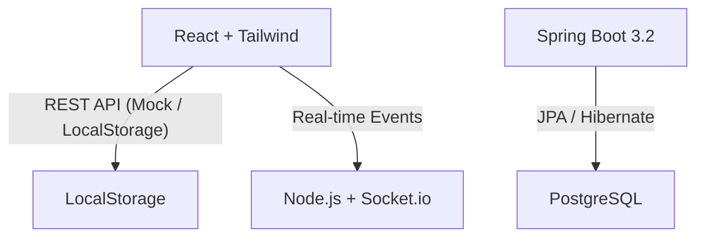

# DSystem - Plataforma de Gestión Docente Fullstack

## 🚀 Arquitectura del Sistema

El sistema está diseñado como una aplicación **SPA (Single Page Application)** conectada a un backend robusto y un microservicio de notificaciones.

> **Nota para GH Pages:** La versión de producción utiliza un **Mock Service** con `localStorage` para permitir la navegación completa sin necesidad de un servidor backend activo.

## 🛠️ Stack Tecnológico

- **Backend:** Java 21, Spring Boot 3.2, JPA, Hibernate, PostgreSQL.
- **Frontend:** React 18, Vite, Tailwind CSS, Lucide Icons, FullCalendar.
- **Seguridad:** JWT (Stateless) & BCrypt para hashing de contraseñas.
- **Real-time:** Node.js, Express, Socket.io.
- **Formularios:** React Hook Form con validaciones personalizadas.

## ✨ Funcionalidades Clave

- **Agenda Interactiva:** Calendario dinámico con FullCalendar para visualizar planificaciones.
- **Dashboard de Métricas:** Resumen rápido de alumnos registrados y actividades próximas.
- **Gestión de Aula:** CRUD completo de Alumnos y Cursos con relaciones Many-to-Many.
- **Planificador de Clases:** Editor avanzado con persistencia y filtrado por docente.
- **Notificaciones Real-time:** Avisos automáticos mediante WebSockets.

## 🔐 Ciberseguridad

- **JWT:** Implementación de filtros de seguridad para interceptar peticiones y validar tokens.
- **BCrypt:** Las contraseñas en el backend se encriptan con un salt adaptativo antes de guardarse en la DB.
- **CORS:** Configuración estricta para permitir solo orígenes de confianza (`*.vercel.app`, `localhost`).

## ⚙️ Instrucciones de Ejecución

### Backend (Java)
1. Instalar PostgreSQL y crear la DB: `CREATE DATABASE sistema_docentes;`.
2. `mvn spring-boot:run`.
3. El archivo `data.sql` poblará la base automáticamente.

### Frontend (React)
1. `cd frontend`.
2. `npm install`.
3. `npm run dev`.
4. Login demo: **admin** / **admin**.

### Microservicio (Notifications)
1. `cd notifications-service`.
2. `npm install`.
3. `node server.js`.

---
*Desarrollado para el Sistema de Gestión Docente - 2026*
